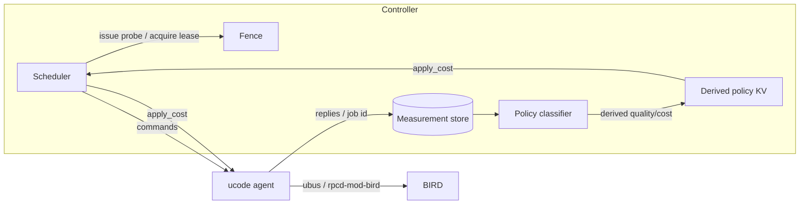

# Architecture

Mielofon is a distributed QoE (link-quality) coordination layer for an OSPF
mesh running over AmneziaWG point-to-point links. It steers traffic to good
links and away from degraded ones, and gives an operator a per-link and path
view of why traffic goes where it goes.

This document describes the controller (`crates/controller`) and the agent
(`mielofon-agent/`, ucode).

> **Sanitization**: this is a public repo describing software for a private
> mesh. Only placeholder node names (`hub-a`..`hub-e`) and RFC-private
> documentation addresses are used.

## Repository

The repo is both the mielofon source **and** an OpenWrt feed. In `feeds.conf`:

```
src-git mielofon https://github.com/vooon/mielofon-qoed.git
```

- `crates/` — Rust workspace source (`controller`, `mielofon-otel`).
- `mielofon-controller/` and `mielofon-agent/` — feed `Package/` definitions.
- OpenWrt's feed scanner ignores non-package directories (e.g. `crates/`).

## Controller

A small asynchronous Rust daemon (tokio + axum + rustls) forming a multi-node
cluster. Runs on a small set of nodes (all voters). The fabric between nodes is
the operator WAN/public network, **not** the mesh underlay, so coordination and
probing stay off the links being measured.

### Consistency

**Eventual** via gossip / anti-entropy with a last-write-wins (LWW) per-link
store. Full linearizable consensus is not required. A node joining/leaving is
handled by membership in the config; a lost node's records age out via the
store's expiry (`grace_ttl_secs`).

### Listeners

| Listener | Port | Transport | Purpose |
|----------|------|-----------|---------|
| members  | 9551 | mTLS (rustls) | cluster gossip / anti-entropy |
| clients  | 9552 | mTLS (rustls) | agents: commands + replies (long-poll) |
| admin    | 9553 | HTTP on loopback | dashboard `/`, `/metrics`, `/healthz`, `/readyz`, read endpoints |

The admin listener binds `127.0.0.1` and is intended to be exposed through a
reverse proxy (e.g. HAProxy). It is **not** mTLS; the proxy is the exposure
boundary.

### Coordination model

The controller is the **decision-maker** for the whole mesh. Two background loops
run inside each controller, decoupling measurement from decision:

1. **Measurement**: probe reports are appended to the replicated time-series
   store (`tsdb`). No classification happens at ingest.
2. **Policy classifier**: a loop re-derives each link's quality class and OSPF
   cost from a *window* of stored samples (per-dimension freshness, with the
   sparse throughput dimension carried for a longer window), and writes the
   derived record to the LWW KV.
3. **Scheduler** issues per-link always-on probe work on a cadence, and gated
   throughput probe work only when the link's fence lease is free (acquiring
   the lease itself before dispatch).
4. The scheduler dispatches `apply_cost` commands when the derived cost differs
   from what an agent last applied.

Because decisions come from the replicated store (a window, not the latest
datapoint), a sparse probe — the gated TCP-throughput probe, skipped while a
link is busy — no longer blanks that dimension from classification: the last
measured value is carried within its freshness window. Measurement and policy
are thus independent; the store is the single source of truth.



The agent is a **thin executor** written in **ucode**: it long-polls the
controller's command endpoint, runs the probe it is told to run, replies with
raw measurements (echoing the job id), and applies the OSPF cost it is told to
apply. It holds no scheduling, policy, or classification logic, and never
acquires the fence itself. Spokes sit behind NAT, so agents pull work from the
controller rather than the controller connecting out to them.

The agent package (`mielofon-agent/`) is `PKGARCH:=all` and installs `.uc`
modules under `/usr/share/ucode/mielofon/` plus a procd init and a UCI config
(`/etc/config/mielofon-agent`) that carries the mTLS identity
(`/etc/mielofon/agent.{key,cert}` + `ca.pem`) and a single `controller_url`.
Key integration points:

- **Transport**: mTLS HTTPS via `ucode-mod-uclient`; the package's KConfig
  guarantees a `libustream-*` TLS backend (openssl preferred, mbedtls fallback)
  is always enabled. The always-on tier runs the resident `ping` binary and
  derives RTT jitter from its RTT distribution; the throughput tier runs
  `iperf3`; BIRD is driven over ubus through `rpcd-mod-bird` (`bird query`), so
  the agent needs no `ucode-mod-socket`.

### Probe fence (soft lease)

The fence is owned entirely by the controller scheduler. A lease has a TTL and
token; only one intrusive throughput probe is scheduled cluster-wide at a time
and the controller releases the lease when the corresponding reply arrives.
Because cluster consistency is eventual, a rare overlap is tolerated and
reported as `conflict` rather than degraded. See `protocol.md`.

> Known limitation: today the fence lives per controller process (in-memory).
> In a multi-node cluster each node schedules independently; as with the rest of
> the fabric this tolerates a rare overlapping throughput probe (reported
> `conflict`). Moving the lease into the replicated gossip store so the fence is
> truly cluster-global is a future step.

### Quality classification

The controller maps reported metrics to `good` / `acceptable` / `poor` / `bad`
using conservative thresholds, and derives a per-link OSPF cost. The controller
**never** writes a dead/broken state — hard outages are owned by the underlay's
dead-interval so the no-controller state is safe. Importantly, a low-RTT link
that is throughput-throttled is still penalised (the key failure mode active
probes must catch).

### Lockdown rules

- mTLS on members + clients, verified against a dedicated CA; no anonymous
  endpoints.
- The CA private key lives on the operator's control plane, not on any node.
- The admin listener is loopback-only plus whatever the proxy is configured to
  expose.

## Observability

Two paths coexist on the admin listener / via OTLP:

- **Prometheus scrape**: `/metrics` on the admin listener serves per-link gauges
  and a reports counter in text exposition format.
- **OpenTelemetry, OTLP/HTTP (gRPC-free)**: traces, logs, and metrics are
  exported to a collector configured under `[otel]`. The
  `opentelemetry-otlp` `grpc-tonic` feature is deliberately not enabled, so no
  gRPC is pulled into the static binary. Configuration mirrors the shape used
  by `pathosd`.

See `crates/mielofon-otel` for the shared telemetry setup.

## Non-goals

- Long-term metric archival (the live store + dashboard is the target).
- Automating real certificate distribution.

## Layout

```
crates/controller/src/
  main.rs        entrypoint: three listeners, background gossip + prune
  config.rs      TOML config (node, members, listeners, tls, quality, otel)
  tls.rs         rustls mTLS (server + client) built from a pinned CA
  state.rs       shared AppState
  store.rs       measurement-store envelope (trait: append/query/window/gossip)
  tsdb.rs        embedded redb-backed ring store implementing `Store`
  kv.rs          LWW per-link store (holds *derived* policy records)
  classifier.rs  background loop: window -> quality/cost -> derived KV
  model.rs       Link, QualityRecord, Quality, ProbeState
  fence.rs       soft-lease probe mutex
  quality.rs     classification + OSPF cost derivation (window-aware)
  api.rs         axum handlers and routers for the three listeners
  gossip.rs      anti-entropy exchange + periodic push loop
  remote.rs      minimal mTLS HTTPS client for gossip pushes
```
