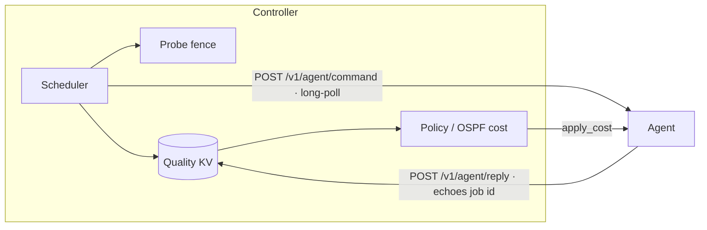

# Protocol

Wiring between the controller, agents, and cluster members. All bodies are
JSON. Endpoints on the **members** (`9551`) and **clients** (`9552`) listeners
are mTLS; the read endpoints on the **admin** listener (`9553`) are loopback
HTTP.

## Division of responsibilities

The **controller is the decision-maker** for the whole mesh: it schedules probe
work, holds the probe fence, classifies quality, derives the OSPF cost policy,
and dispatches commands to agents.

The **agent is a thin executor**: it runs whatever probe it is told to run and
reports raw measurements, and it applies the OSPF cost it is told to apply.
It holds **no** scheduling, policy, or classification logic and never acquires
the fence itself.

Because spokes sit behind NAT, the controller→agent channel is **agent-pull via
a long-poll**: the agent registers, then holds an mTLS long-poll on the command
endpoint; the controller returns queued commands (or an empty batch on
timeout), and the agent immediately re-polls. Every command carries a **job
identifier**, and every reply to it echoes that `id`. The controller never
connects out to an agent.



## Quality record

A directed link `{from, to, interface}` maps to a measurement record:

```json
{
  "ts": 1747000000,
  "rtt_ms": 15.0,
  "loss_pct": 0.0,
  "rr_tps": 90.0,
  "tcp_mbps": 1.5,
  "udp_mbps": null,
  "util_mbps": 0.0,
  "state": "quiet",
  "quality": "poor",
  "ospf_cost": 50
}
```

`state` is `quiet` | `busy` | `conflict`. `quality`
(`good|acceptable|poor|bad`) and `ospf_cost` are assigned by the controller.

## Agent lifecycle

### Register

```jsonc
POST /v1/agent/register           // clients
{ "agent": "spoke-1",
  "links": [ {"from":"spoke-1","to":"hub-a","interface":"awg_hub_a"} ] }
// -> { "ok": true, "commands": [ {apply_cost …} ] }   // current policy snapshot
```

### Pull commands (long-poll)

```jsonc
POST /v1/agent/command            // clients
{ "agent": "spoke-1", "timeout_ms": 30000 }
// -> { "commands": [ … ] }        // drained; { "commands": [] } on timeout;
//                                   the agent re-polls immediately
```

Command shapes — each carries a job `id`:

```jsonc
{ "id": "always/spoke-1/…", "type": "probe", "tier": "always",
  "link": { "from":"spoke-1","to":"hub-a","interface":"awg_hub_a" } }

{ "id": "throughput/spoke-1/…", "type": "probe", "tier": "throughput",
  "token": "6e4a…",                    // fence lease held by the controller
  "link": { … } }

{ "id": "apply/spoke-1/…", "type": "apply_cost",
  "link": { … }, "cost": 50 }
```

The controller's scheduler issues `probe/always` per link on an interval, and
`probe/throughput` only when the link's fence lease is free — it acquires the
lease before issuing the command. `apply_cost` is issued when the derived cost
for a link differs from the last cost the controller told the agent to apply.
While no agent is long-polling, probe work is not queued (bounded); the policy
snapshot is re-seeded through `register` on reconnect.

### Reply

Every reply echoes the command's job `id`:

```jsonc
POST /v1/agent/reply              // clients
{ "id": "always/spoke-1/…", "kind": "probe",
  "link": { … },
  "rtt_ms":15.0, "loss_pct":0.0, "rr_tps":90.0,
  "tcp_mbps":null, "util_mbps":0.0, "state":"quiet", "token": null }

{ "id": "apply/spoke-1/…", "kind": "applied", "link": { … }, "cost": 50 }
```

- Always-on replies carry no token. Throughput replies echo the fence token
  from the command; the controller releases the lease on receipt.
- A busy link is reported `state: "busy"` (with `util_mbps`) and is never
  classified as degraded.
- `/v1/quality` and `/v1/apply/ack` remain supported as the equivalent
  non-correlated endpoints.

## Fence (soft lease)

Owned entirely by the controller scheduler. A lease has a TTL and token; on
expiry without a report it may be re-issued. An overlapping throughput probe is
tolerated and reported as `conflict`.

## Read endpoints (admin listener)

```text
GET /v1/quality?from=..&to=..&interface=..   latest record for a link
GET /v1/quality/all                          full replicated view
GET /v1/policy?from=..&to=..&interface=..    quality + ospf_cost decision
GET /v1/status                               node, readiness, leases, agents
GET /healthz                                 200 when process is up
GET /readyz                                  200 when ready, 503 otherwise
GET /metrics                                 Prometheus text exposition
```

## Gossip (anti-entropy)

Members exchange the full KV view. LWW merge keeps the newest `ts` per link;
records older than `grace_ttl_secs` expire.

```jsonc
POST /v1/gossip/exchange          // members
{ "node": "hub-a", "records": [[…]] }
// -> { "node": "hub-b", "records": […] }
```